# MCP Security Scanner - Mermaid Architecture Diagrams

## Overall System Architecture

```mermaid
graph TB
    subgraph "MCP SECURITY SCANNER"
        subgraph "Core Scanners"
            SS[Server Scanner<br/>• Manifest validation<br/>• Schema checking<br/>• Permission audit<br/>• Typo detection<br/>• Semantic analysis]
            WS[Workspace Scanner<br/>• Prompt injection<br/>• MCP tool extraction<br/>• Code pattern match<br/>• Zero-width chars<br/>• Security patterns]
            DS[Dependency Scanner<br/>• CVE detection<br/>• Typosquatting<br/>• Version checks<br/>• Package analysis<br/>• Lock verification]
        end
        
        subgraph "Security Analyzers"
            TD[Typo Detector<br/>• Levenshtein ≤ 2<br/>• Dice coefficient<br/>• Homograph check<br/>• TF-IDF + Cosine]
            SA[Semantic Analyzer<br/>🤖 OpenAI LLM Analysis<br/>• Description vs Schema<br/>• Permission mismatch<br/>• Capability drift]
        end
        
        subgraph "Cryptographic Security"
            TH[Tool Hashing<br/>• Canonical JSON<br/>• SHA-256 Hash]
            SIG[Sigstore Signing<br/>• DSSE Format<br/>• OIDC Auth<br/>• Transparency]
            VT[Version Tracking<br/>• Hash comparison<br/>• Change detection<br/>• Notifications]
        end
        
        subgraph "Reporting Engine"
            MD[Markdown Report]
            JSON[JSON Report]
            SARIF[SARIF Report]
        end
    end
    
    SS --> TD
    SS --> SA
    WS --> TD
    WS --> SA
    DS --> TD
    
    SS --> TH
    WS --> TH
    DS --> TH
    
    TH --> VT
    TH --> SIG
    
    TD --> MD
    TD --> JSON
    TD --> SARIF
    SA --> MD
    SA --> JSON
    SA --> SARIF
    VT --> MD
    VT --> JSON
    VT --> SARIF
```



## Data Flow Diagram

```mermaid
graph LR
    URL[MCP Server URL] --> FETCH[Fetch Manifest<br/>HTTP/S Request]
    FETCH --> VALIDATE[Validate Schema<br/>JSONSchema + Rules]
    VALIDATE --> ANALYZE[Analyze Security<br/>• Typo<br/>• Semantic<br/>• Crypto]
    ANALYZE --> REPORT[Report Findings<br/>MD/JSON/SARIF]
    REPORT --> EXIT[Exit Code]
```



## Change Management Workflow

```mermaid
stateDiagram-v2
    [*] --> Detection: Tool/Permission Change
    Detection --> Notify: Risk Level Assessed
    Notify --> Approval: Stored in SQLite
    Approval --> Approved: ✓ Approve via CLI/API
    Approval --> Rejected: ✗ Reject via CLI/API
    Approved --> Applied: Tool Active
    Rejected --> Blocked: Tool Blocked
    Applied --> Tracked: Changes Logged
    Blocked --> Tracked: Changes Logged
    Tracked --> [*]
```



## Security Finding Categories

```mermaid
graph TD
    FINDINGS[Security Findings] --> CRITICAL[CRITICAL 10.0<br/>Immediate security risk]
    FINDINGS --> HIGH[HIGH 7.0<br/>Serious security concern]
    FINDINGS --> MEDIUM[MEDIUM 4.0<br/>Moderate risk]
    FINDINGS --> LOW[LOW 1.0<br/>Minor issue]
    FINDINGS --> INFO[INFO 0.0<br/>Informational]
    
    CRITICAL --> TYPES[Finding Types]
    HIGH --> TYPES
    MEDIUM --> TYPES
    LOW --> TYPES
    INFO --> TYPES
    
    TYPES --> T1[🎭 TYPOSQUATTING<br/>Lookalike server names]
    TYPES --> T2[🔀 SEMANTIC_DRIFT<br/>Description mismatch]
    TYPES --> T3[🚨 DEPENDENCY_VULN<br/>Known CVEs]
    TYPES --> T4[💉 PROMPT_INJECTION<br/>Hidden instructions]
    TYPES --> T5[🔓 EXCESSIVE_PERMS<br/>Dangerous permissions]
    TYPES --> T6[📝 SCHEMA_VIOLATION<br/>Invalid manifest]
    TYPES --> T7[🔏 SIGNATURE_INVALID<br/>Missing signature]
    TYPES --> T8[📊 VERSION_CHANGE<br/>Tool definition changed]
```



## Tool Hashing Process


## CLI Command Structure


## Language Extractor Architecture

```mermaid
graph TB
    CODE[Source Code] --> PARSER[Tree-sitter Parser]
    
    PARSER --> PY[Python Extractor<br/>@tool decorator]
    PARSER --> JS[JavaScript Extractor<br/>tool objects]
    PARSER --> TS[TypeScript Extractor<br/>tool definitions]
    PARSER --> GO[Go Extractor<br/>tool structs]
    PARSER --> RUST[Rust Extractor<br/>tool macros]
    PARSER --> JAVA[Java Extractor<br/>@Tool annotation]
    PARSER --> CS[C# Extractor<br/>[Tool] attribute]
    PARSER --> RUBY[Ruby Extractor<br/>tool methods]
    PARSER --> PHP[PHP Extractor<br/>tool arrays]
    
    PY --> TOOLS[Extracted Tools<br/>with line numbers]
    JS --> TOOLS
    TS --> TOOLS
    GO --> TOOLS
    RUST --> TOOLS
    JAVA --> TOOLS
    CS --> TOOLS
    RUBY --> TOOLS
    PHP --> TOOLS
    
    TOOLS --> ANALYSIS[Security Analysis]
```

## Feature Implementation Status


## Risk Scoring Distribution

